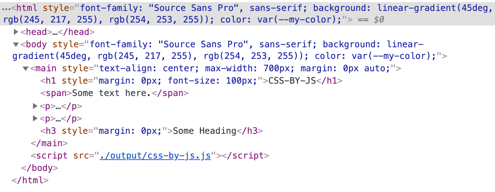

# CSS by JS

The next iteration of CSS-in-JS. Turn your CSS into JS that turns it into CSS.

## Description

This a CLI tool that will turn a CSS file into JS, which will then apply the styles to the DOM when loaded in the browser. So, you write CSS, but you never load a single `*.css` file onto your page. It's left to JS, which is doing eveything else these days anyway.

For example, this CSS:

```css
:root {
  --my-color: #1a1a1a;
}

body,
html {
  font-family: "Source Sans Pro", sans-serif;
  background: linear-gradient(45deg, #f5d9ff, #fefdff);
  color: var(--my-color);
}

main {
  text-align: center;
  max-width: 700px;
  margin: 0 auto;
}

h1,
h3 {
  margin: 0;
}
```

Turns into this, which is then passed to a `applyCSS` function:

```javascript
[
  { name: ":root", properties: [{ name: "--my-color", value: "#1a1a1a" }] },
  {
    name: "body, html",
    properties: [
      { name: "font-family", value: "'Source Sans Pro', sans-serif" },
      { name: "background", value: "linear-gradient(45deg, #f5d9ff, #fefdff)" },
      { name: "color", value: "var(--my-color)" }
    ]
  },
  {
    name: "main",
    properties: [
      { name: "text-align", value: "center" },
      { name: "max-width", value: "700px" },
      { name: "margin", value: "0 auto" }
    ]
  },
  { name: "h1, h3", properties: [{ name: "margin", value: "0" }] }
];
```

And when the output is loaded on your page, you get styles:

```html
<script src=".output/css-by-js.js"></script>
```



## Installation

`npm install css-by-js`

## Usage

You just need to pass in a reference to a CSS file, as well as location where the file will be outputted.

`css-by-js --file=./assets/sample.css --output=./assets/output.js`

A `--file` is required. If no `--output` is specified, a `css-by-js.js` file will be created in the current directory.

## Support

I can't imagine it works perfectly in every scenario, but I've designed the tool to handle simple element CSS rules (`div{}`), pseudo-elements, and even CSS custom properties. If you find an oddball out there, make file an issue or make a contribution.

## Why would I use this?

I'll leave that up to you.

## License

MIT © [Alex MacArthur](https://macarthur.me)
